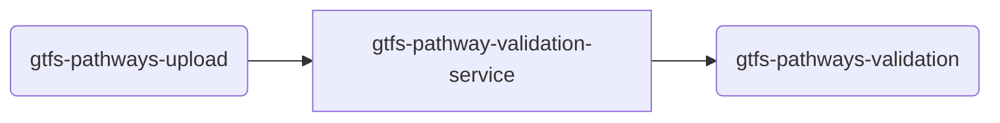

# TDEI-GTFS-Pathways-Validation

## Introduction 
Service to Validate the GTFS Pathways file that is uploaded. At the moment, the service does the following:
- Listens to the topic _gtfs-pathways-upload_ for any new message (that is triggered when a file is uploaded)
- Consumes the message and checks the filename in the message
  - if the filename contains the word _valid_ returns **valid** as the result
  - if the filename contains the word _invalid_ returns **invalid** as the result
  - if the file name does not contain either, it will return **invalid** as the result
- Publishes the result to the topic _gtfs-pathways-validation_

## Getting Started
The project is built on top of NodeJS framework. All the regular nuances for a NodeJS project are valid for this.

### System requirements
| Software | Version|
|----|---|
| NodeJS | 16.17.0|
| Typescript | 4.8.2 |


### Build and Test
Follow the steps to install the node packages required for both building and running the application

1. Install the dependencies. Run the following command in terminal on the same directory as `package.json`
    ```shell
    npm install
    ```
2. To start the server, use the command `npm run start`
3. The http server by default starts with 3000 port or whatever is declared in `process.env.PORT` (look at `index.ts` for more details)
4. By default `get` call on `localhost:3000` gives a sample response
5. Other routes include a `ping` with get and post. Make `get` or `post` request to `http://localhost:3000/health/ping`


### Connectivity to cloud
- Connecting this to cloud will need the following in the `.env` file

```bash

QUEUECONNECTION=xxxx

```
The application right now does not connect with the storage but validates via the file name.


### Messaging

This micro service deals with two topics/queues. 
- upload queue from gtfs-pathways-upload
- validation queue from gtfs-pathways-validation



#### Incoming
The incoming messages will be from the upload queue `gtfs-pathways-upload`.
The format is mentioned in [msg-gtfs-pathway-upload.json](./src/assets/msg-gtfs-pathway-upload.json)

#### Outgoing
The outgoing messages will be to the `gtfs-pathways-validation` topic.
The format of the message is at [gtfs-pathway-validation.json](./src/assets/msg-gtfs-pathway-validation.json)


## CI/CD
The application will be hosted with the docker image. Default port is 8080.